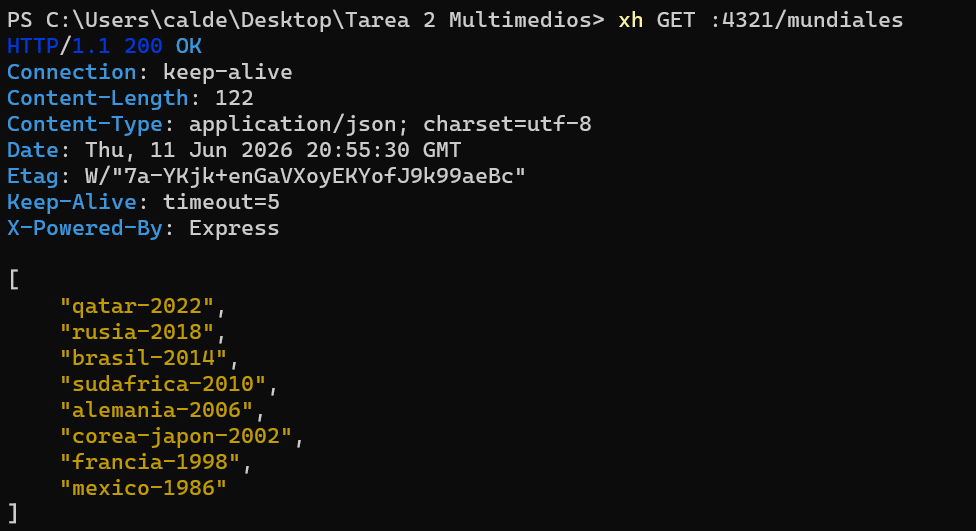
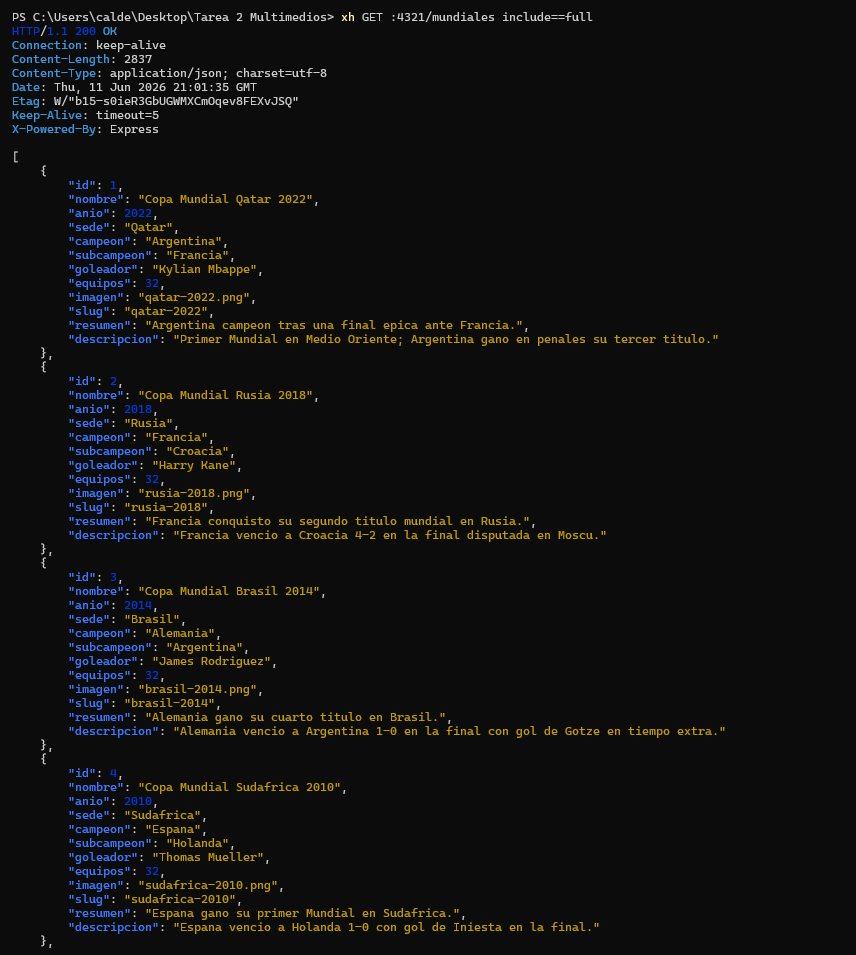
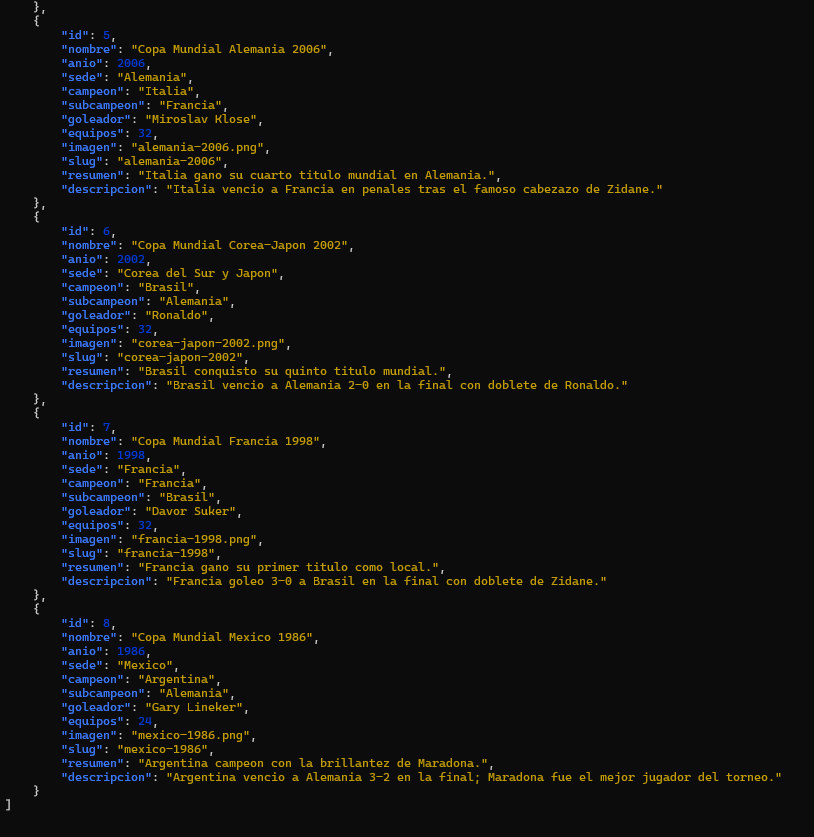
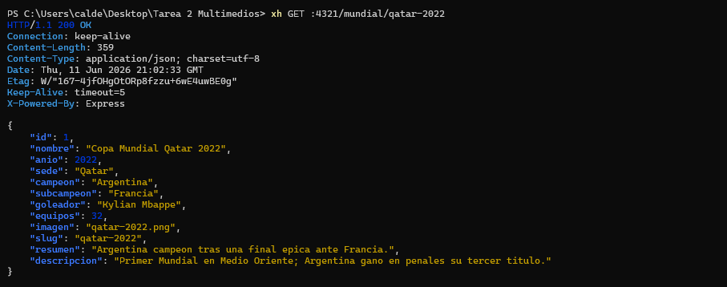
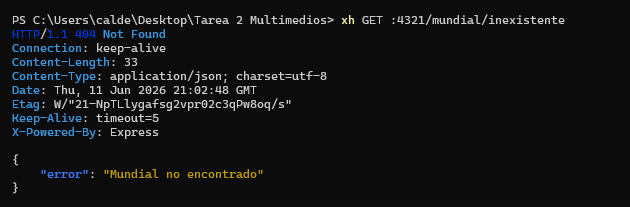
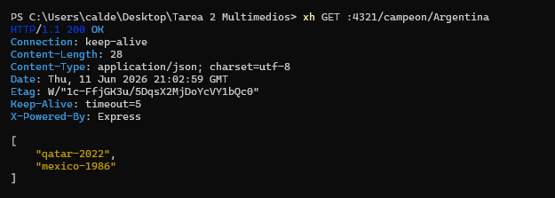
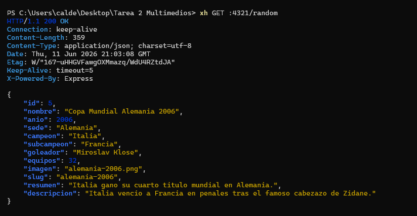
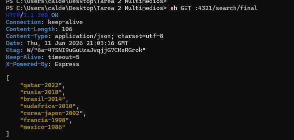
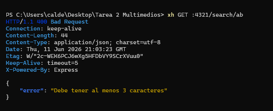

# API Mundial FIFA

API REST sobre la Copa Mundial de la FIFA construida con Node.js, Express y SQLite.

## Instalacion

```bash
pnpm install
```

## Crear la base de datos

```bash
node data/createdb.js
```

O usar el script:

```bash
pnpm createdb
```

## Ejecutar el servidor

```bash
pnpm dev
```

El servidor inicia en `http://localhost:4321`

## Rutas disponibles

| Metodo | Ruta               | Descripcion                          |
| ------ | ------------------ | ------------------------------------ |
| GET    | `/`                | Informacion de la API                |
| GET    | `/mundiales`       | Slugs o info completa con `?include=full` |
| GET    | `/mundial/:slug`   | Buscar mundial por slug              |
| GET    | `/campeon/:pais`   | Slugs ganados por un pais            |
| GET    | `/random`          | Mundial aleatorio                    |
| GET    | `/search/:text`    | Buscar por texto en varios campos    |
| GET    | `/imagenes/*`      | Imagenes estaticas                   |

## Pruebas documentadas

A continuacion se muestran las pruebas realizadas con `xh` para verificar el correcto funcionamiento de la API.

### Prueba 1: Listar mundiales (solo slugs)

```bash
xh GET :4321/mundiales
```

Respuesta esperada: `200 OK` con un arreglo de slugs.



---

### Prueba 2: Listar mundiales (informacion completa)

```bash
xh GET :4321/mundiales include==full
```

Respuesta esperada: `200 OK` con toda la informacion de cada mundial.





---

### Prueba 3: Buscar mundial por slug (existente)

```bash
xh GET :4321/mundial/qatar-2022
```

Respuesta esperada: `200 OK` con los datos del mundial Qatar 2022.



---

### Prueba 4: Buscar mundial por slug (inexistente)

```bash
xh GET :4321/mundial/inexistente
```

Respuesta esperada: `404 Not Found` con `{"error": "Mundial no encontrado"}`.



---

### Prueba 5: Mundiales ganados por un pais

```bash
xh GET :4321/campeon/Argentina
```

Respuesta esperada: `200 OK` con los slugs de mundiales ganados por Argentina.



---

### Prueba 6: Mundial aleatorio

```bash
xh GET :4321/random
```

Respuesta esperada: `200 OK` con un mundial seleccionado al azar.



---

### Prueba 7: Buscar por texto (valido)

```bash
xh GET :4321/search/final
```

Respuesta esperada: `200 OK` con los slugs que contienen "final" en sus campos.



---

### Prueba 8: Buscar por texto (invalido - muy corto)

```bash
xh GET :4321/search/ab
```

Respuesta esperada: `400 Bad Request` con `{"error": "Debe tener al menos 3 caracteres"}`.



---

## Tecnologias

- Node.js (ES Modules)
- Express
- SQLite (node:sqlite)
- Zod
- dotenv
